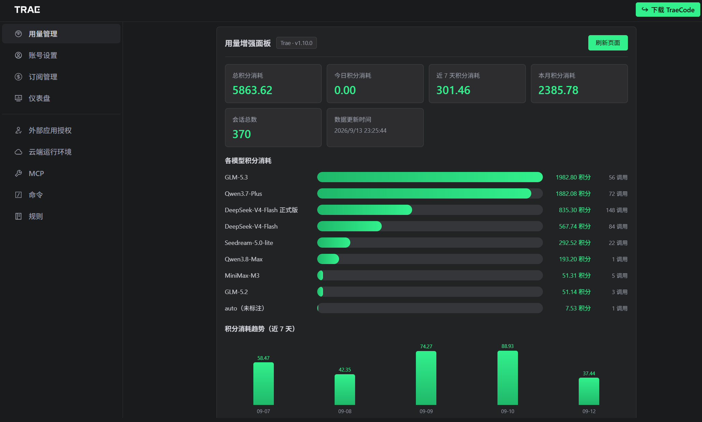
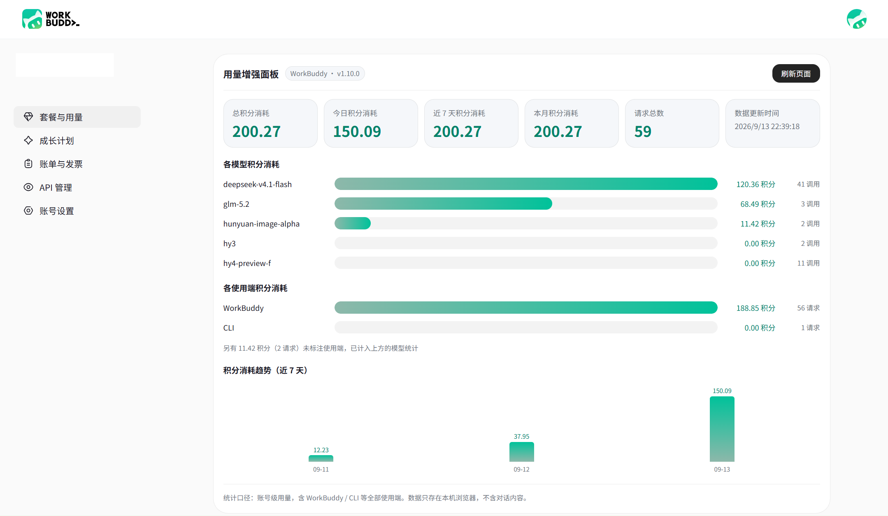

# Trae / QwenWork / WorkBuddy 用量仪表盘增强


为 [Trae](https://www.trae.cn)、[QwenWork](https://qwenwork.cn) 与 [WorkBuddy](https://www.workbuddy.cn) 的用量页面添加增强统计功能的油猴脚本。脚本通过拦截页面 API 请求或从 DOM 提取数据，在页面内输出总积分消耗、模型分布、使用端分布与近 7 天消耗趋势。

只做浏览器端的数据展示增强：不修改任何服务器数据，不上传任何数据。

## 支持平台

| 平台 | 用量页面 | 数据获取方式 | 面板主题 |
| --- | --- | --- | --- |
| Trae | [www.trae.cn/dashboard](https://www.trae.cn/dashboard) | 拦截 API + 自动翻页 | 深色，强调色取页面主按钮的亮绿 |
| QwenWork | [qwenwork.cn/app/settings/usage](https://qwenwork.cn/app/settings/usage) | DOM 文本提取 | 浅色，强调色取品牌紫 |
| WorkBuddy | [www.workbuddy.cn/profile/plans-usage](https://www.workbuddy.cn/profile/plans-usage) | 拦截 API + 自动翻页 | 浅色，强调色取品牌青绿 |

脚本按域名与路径自动识别当前平台，不需要手动切换。

## 功能特性

- **多平台支持**：同一份脚本覆盖三个用量页面，各自适配数据来源与配色。
- **脚本管理器无关**：只依赖标准 GM 接口，对未实现的接口自动兜底；Tampermonkey 与 ScriptCat 均可使用。
- **面板置于内容区顶部**：打开页面即可看到，无需滚到页面底部；面板与页面共用同一条滚动条，宽度与页面内容列对齐。
- **与页面融为一体**：三套主题的底色、描边、圆角、强调色、字体栈都取自各自页面的真实取值，面板看起来像页面自带的一块，而不是外挂的插件。
- **多维度统计**：总积分消耗、今日消耗、近 7 天消耗、本月消耗、记录总数。
- **模型分布**：按模型汇总积分与调用次数，并用条形图对比。
- **未标注条目可展开**：模型名缺失或为 `-`（页面用短横线表示未公布）的条目支持展开查看消耗构成，默认收起。它的下级是「每日积分过期」「透支扣减」这类并非模型的条目，在别处没有对应位置，因此单独保留。
- **原样呈现采集结果**：脚本不改写接口给出的值——模型名是 `-` 就显示 `-`、是 `auto` 就显示 `auto`，不会翻译成别的说法。
- **模型归属按接口的分组**：一次对话可能横跨多个模型，脚本按接口给出的每个模型各自的消耗归属，不会把整笔算到其中一个模型名下。
- **使用端分布**：WorkBuddy 的用量接口按使用端（WorkBuddy / CLI 等）区分，面板单独给出一节。由于 WorkBuddy 与 CodeBuddy 共用同一账号积分池，这里的口径是**账号级总消耗**。未标注使用端的记录（接口未给出该字段）不计入本节，它们已按真实模型归入「各模型积分消耗」，本节下方会说明其数量与去向。
- **趋势可视化**：近 7 天每日积分消耗柱状图。
- **自动翻页**：从接口响应的分页字段推导总页数，自动拉取剩余分页，每页间隔 300ms。
- **自动重试**：页面加载后多策略触发数据获取，避免面板空白。
- **SPA 适配**：监听 DOM 变化，页面路由切换导致面板被移除时自动重建。
- **本地持久化**：数据存于浏览器本地（GM 存储），刷新或切路由后不丢失。

## 效果预览

### Trae（深色主题）



### QwenWork（浅色主题 · 品牌紫）


### WorkBuddy（浅色主题 · 青绿）



## 安装

1. 安装用户脚本管理器：
   - [Tampermonkey](https://www.tampermonkey.net/)（推荐）
   - [ScriptCat](https://scriptcat.org/zh-CN)（脚本猫，已适配其异步存储）
   - 其它实现了 `GM_getValue` / `GM_setValue` / `GM_addStyle` 的管理器理论上可用。

2. 点击下方链接直接安装：

   [直接安装脚本](https://raw.githubusercontent.com/asdfz2/Trae_Qwen-dashboard-enhancer/main/trae-dashboard-enhancer.user.js)

3. 或者复制 `trae-dashboard-enhancer.user.js` 的内容，在脚本管理器中新建脚本并保存。

## 使用

1. 打开对应的用量页面（见上方「支持平台」）。
2. 增强面板会自动出现在页面内容区域的最顶端，与页面内容共用同一条滚动条。
3. 在站内切换到其它页面后面板会自动隐藏，回到用量页面时自动恢复。
4. 如果没有数据，点击面板右上角的「刷新页面」按钮重试。

## 工作原理

脚本先包装 `fetch` 与 `XMLHttpRequest`，只处理与用量相关的接口。命中后按平台各自的字段映射解析出统一的记录对象，按记录 ID 去重后写入 GM 本地存储，再由同一套统计与渲染逻辑输出面板。

三个平台的差异被收敛在脚本顶部的平台适配表里：识别规则、存储键、主题、命中哪些接口、如何解析响应、如何构造下一页请求、以及首次如何采集数据。

- **Trae**：拦截用量查询接口，按接口返回的分页字段自动翻页。
- **QwenWork**：用量接口返回 404，改为从页面已渲染的文本中解析消耗记录，并自动点击翻页控件遍历所有页。
- **WorkBuddy**：拦截 `/billing/meter/get-user-request-usage`，按 `pageNum` 自动翻页；首次进入页面时会主动请求最近 30 天数据，避免只拿到页面默认的 7 天范围。

拦截未命中时的回退顺序：点击页面上的时间范围按钮触发新请求 → 主动调用用量接口 → 从 DOM 文本兜底提取。

详细设计见 [docs/ARCHITECTURE.md](docs/ARCHITECTURE.md)。

## 项目结构

```text
.
├── CHANGELOG.md
├── LICENSE
├── README.md
├── docs/
│   ├── ARCHITECTURE.md
│   └── images/
│       ├── QwenWork.png
│       ├── Trae.png
│       └── WorkBuddy.png
└── trae-dashboard-enhancer.user.js
```

## 数据与隐私

- 所有数据只存储在浏览器本地（`GM_setValue`），不会上传到任何服务器。
- **WorkBuddy 的用量接口会同时返回对话提示词原文（`input` / `inputTrunc` 字段）。脚本只提取积分、模型、时间、使用端等统计字段，不保存任何对话内容。**
- 每个平台使用独立的存储键（`trae_usage_data` / `qwenwork_usage_data` / `workbuddy_usage_data`），互不干扰。
- **接口返回的用户内容一律不落盘**：WorkBuddy 的对话提示词原文（`input` / `inputTrunc`）与 Trae 的输入预览片段（`user_input_preview`）在归一化阶段即被丢弃。脚本也不保存任何原始接口响应体。
- 本地最多保留最近 5000 条记录，自动清理更早的数据。
- 自动翻页请求间隔 300ms，避免给服务端造成压力。
- 脚本只做数据展示增强，不修改任何服务器数据。

## 兼容性与限制

**Trae**

- 依赖 Trae 内部接口路径，官方调整接口后可能需要同步更新。
- 首次使用时，脚本需要先抓到「30 天」范围的用量请求才能自动翻页。请先点击用量页上的「30 天」按钮，再手动往下翻两页，让脚本拿到全量分页起点。

**QwenWork**

- 数据通过解析页面文本获得，若页面结构调整，提取逻辑需要同步更新。
- 需要页面上的「已使用」区域可以展开，否则取不到记录。

**WorkBuddy**

- 用量页需要登录，脚本只在已登录状态下有效。
- 面板统计的是**账号级**用量，包含 CodeBuddy CLI 等其它使用端的消耗。口径与页面一致，但维度更细。
- 主动采集默认取最近 30 天，更早的历史不会出现在面板里。

**通用**

- 对全局 `fetch` 与 `XMLHttpRequest` 做了包装，若目标页面依赖原始函数的身份，可能需要调整。
- 当前没有自动化测试，改动后建议在三个平台的真实用量页各做一次回归。

## FAQ

**面板没有出现？**

确认脚本管理器里已启用脚本，并重新打开用量页面；仍无数据时点击面板中的「刷新页面」按钮。

**统计数据看起来不完整？**

重新打开用量页面，脚本会再次拦截请求并拉取全量分页数据。

**面板里的数字和页面上的不一致？**

两者的统计范围可能不同。面板汇总的是脚本能覆盖到的全部已采集记录（Trae 为全部分页，WorkBuddy 为最近 30 天），页面默认展示的可能是更小的范围（例如 7 天）。

**数据会上传吗？**

不会。全部数据只写入浏览器本地的 GM 存储，脚本不含任何上报逻辑。

**怎么排查问题？**

把脚本里的 `const DEBUG = false;` 改成 `true`，控制台会输出完整流程日志。

## 贡献

欢迎通过 [Issues](https://github.com/asdfz2/Trae_Qwen-dashboard-enhancer/issues) 提交反馈或建议。

## 许可证

[MIT](LICENSE)
