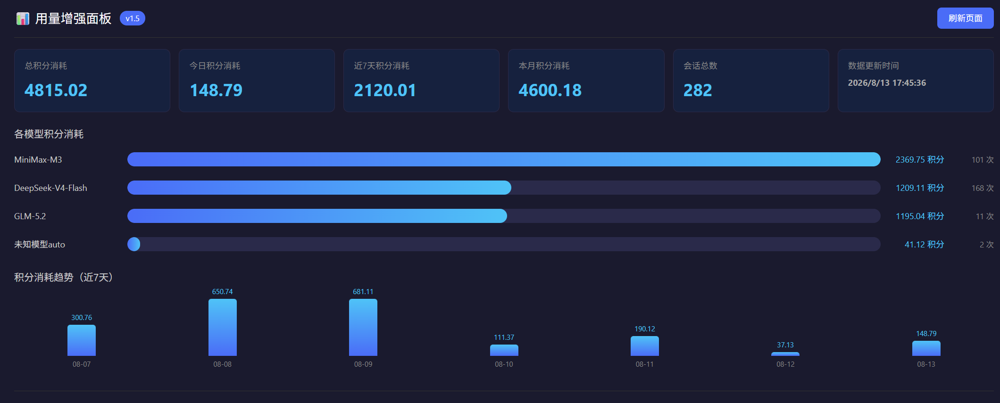
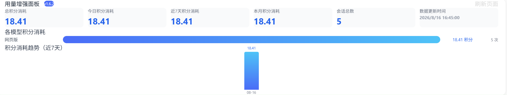

# Trae / QwenWork 用量仪表盘增强

为 [Trae](https://www.trae.cn) 个人版和 [QwenWork](https://qwenwork.cn) 用量页面添加增强统计功能的油猴脚本。脚本通过拦截页面 API 请求或从 DOM 提取数据，在页面内输出总积分消耗、模型 breakdown 和近 7 天消耗趋势。

仅做浏览器端数据展示增强，不修改任何服务器数据。

## 功能特性

- **多平台支持**：同时支持 Trae（深色主题）和 QwenWork（浅色主题），自动检测域名并适配。
- **多维度统计**：总积分消耗、今日消耗、近 7 天消耗、本月消耗、会话总数。
- **模型 breakdown**：展示每个模型消耗的积分与调用次数，并用条形图对比。
- **趋势可视化**：近 7 天每日积分消耗柱状图。
- **自动翻页**：拦截 API 响应中的分页字段，自动拉取全部历史数据，无需手动翻页。
- **自动重试**：页面加载后多策略触发数据获取，避免面板空白。
- **SPA 适配**：监听 DOM 变化，页面路由切换后自动恢复面板。
- **本地持久化**：数据存于浏览器本地（GM 存储），刷新页面不丢失。

## 效果预览

### Trae（深色主题）



### QwenWork（浅色主题）



## 安装

1. 安装用户脚本管理器：
   - [Tampermonkey](https://www.tampermonkey.net/)（推荐）
   - [ScriptCat](https://scriptcat.org/zh-CN)

2. 点击下方链接直接安装：

   [直接安装脚本](https://raw.githubusercontent.com/asdfz2/trae-dashboard-enhancer/main/trae-dashboard-enhancer.user.js)

3. 或者复制 `trae-dashboard-enhancer.user.js` 内容，在脚本管理器中新建脚本并保存。

## 使用

1. 打开用量页面：
   - Trae：[用量页面](https://www.trae.cn/dashboard#usage)
   - QwenWork：[用量页面](https://qwenwork.cn/app/settings/usage)
2. 增强面板会自动出现在页面内容区域。
3. 如果没有数据，点击面板中的「刷新页面」按钮重试。

## 工作原理

- 脚本先包装 `fetch` 与 `XMLHttpRequest`，只处理 Trae / QwenWork 相关 API。
- 从用量查询接口的响应中读取分页字段，自动请求剩余分页，每页间隔 300ms。
- 会话数据按 `session_id` 合并去重后写入 GM 本地存储。
- 统计与图表由原生 JavaScript 在页面中渲染。
- 拦截器未命中时，依次回退：点击页面按钮触发请求 → 主动调用用量 API → 从 DOM 文本兜底提取。
- QwenWork 的 API 全部返回 404，脚本自动切换到 DOM 提取模式，从页面已渲染的文本中解析积分消耗记录。

详细设计见 [docs/ARCHITECTURE.md](docs/ARCHITECTURE.md)。

## 项目结构

```text
.
├── CHANGELOG.md
├── LICENSE
├── README.md
├── docs/
│   ├── ARCHITECTURE.md
│   └── images/
│       ├── QwenWork.png
│       ├── dashboard-preview.png
│       └── demo-screenshot.png
└── trae-dashboard-enhancer.user.js
```

## 数据与隐私

- 数据只存储在浏览器本地（`GM_setValue`），不会上传到任何服务器。
- 自动翻页请求间隔 300ms，避免给服务端造成压力。
- 脚本只做数据展示增强，不修改任何服务器数据。

## 兼容性与限制

- 目标页面：Trae 用量 Dashboard、QwenWork 用量页面。
- 脚本依赖 Trae 内部 API 路径，官方调整接口后可能需要更新。
- QwenWork 的 `/api/v1/usage_records` 接口返回 404，数据通过 DOM 提取获取，仅展示当前页面已加载的记录。
- 本地只保留最近 100 条原始 API 响应，避免存储无限膨胀。

## FAQ

**面板没有出现？**

确认用户脚本已启用，并重新打开用量页面；仍无数据时点击「刷新页面」按钮。

**统计数据看起来不完整？**

重新打开用量页面，脚本会再次拦截请求并拉取全量分页数据。

**首次使用如何采集完整数据？**

首次使用时，脚本只会自动抓取当前页面已加载的范围。请先点击页面上的「**30 天**」按钮，再手动往下翻两页，脚本即可自动采集到完整的分页数据并持久化到本地；之后刷新页面即可直接看到完整统计。

## 使用说明（已知限制）

- 自动翻页依赖页面按「30 天」加载用量请求。首次使用需手动点击「30 天」并翻两页，让脚本抓到全量分页起点，之后才能自动拉取全部历史。
- 数据存于浏览器本地（GM 存储），跨刷新保留；切换范围或清空浏览器数据后，可能需要重新执行上述步骤。

## 贡献

欢迎通过 [Issues](https://github.com/asdfz2/trae-dashboard-enhancer/issues) 提交反馈或建议。

## 许可证

[MIT](LICENSE)
